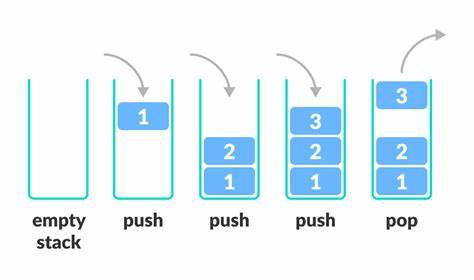
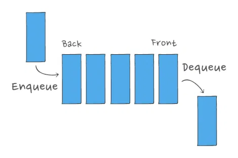

# Stacks & Queues

## Stacks

It is a type of linear data structures that follows the concepts of last in first out (LIFO), and first in last out (FILO). In the real world it's like a pile of plates stacked over each other and the first plate can be removed from that pile is the one on top (last plate was put on the pile).

## Queues

- It is a type of linear data structures that follows the concept of first in first out (FIFO), and last in last out (LILO). In the real world it's like a queue line for ordering in a resturant, the first one in the line is the first one who can order, and the last one on the line is the last one to order.

