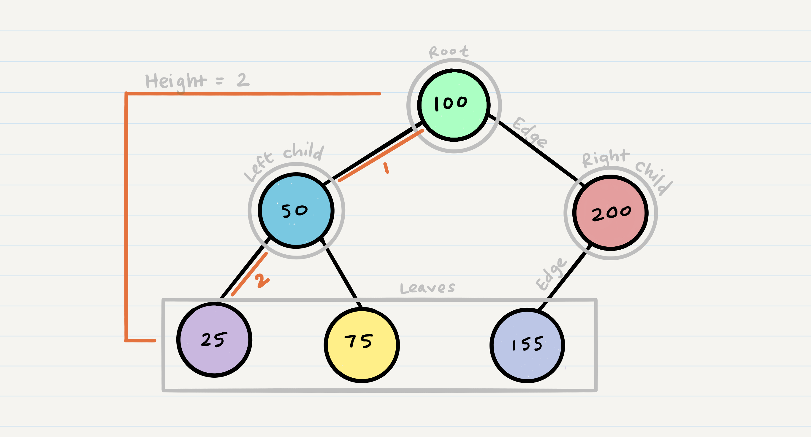
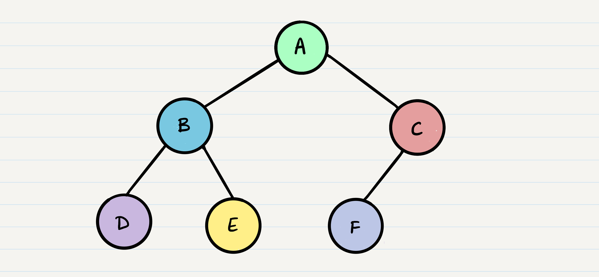
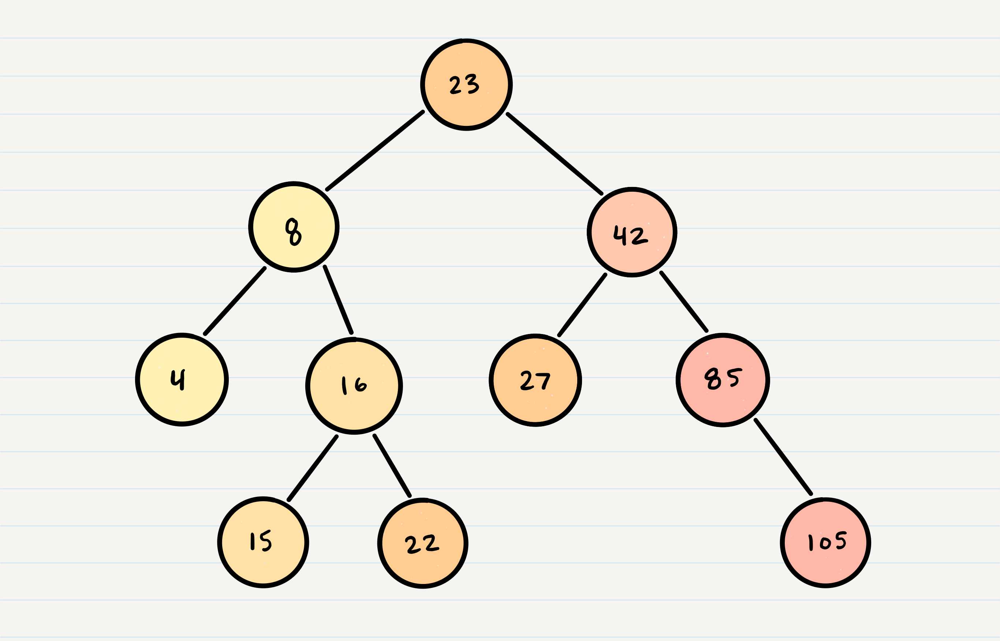

# Trees

|Table of contents|
|-----------------|
|[Common Terminology](#common-terminology)|
|[Traversals](#Traversals)|
|[K-ary Trees](#k-ary-trees)|
|[Binary Search Trees](#binary-search-trees)|

## Common Terminology

- Node - A Tree node is a component which may contain its own values, and references to other nodes
- Root - The root is the node at the beginning of the tree
- K - A number that specifies the maximum number of children any node may have in a k-ary tree. In a binary tree, k = 2.
- Left - A reference to one child node, in a binary tree
- Right - A reference to the other child node, in a binary tree
- Edge - The edge in a tree is the link between a parent and child node
- Leaf - A leaf is a node that does not have any children
- Height - The height of a tree is the number of edges from the root to the furthest leaf

**Sample Tree**

## Traversals
An important aspect of trees is how to traverse them. Traversing a tree allows us to search for a node, print out the contents of a tree, and much more! There are two categories of traversals when it comes to trees:

- Depth First
- Breadth First

### Depth First 
Depth first traversal is where we prioritize going through the depth (height) of the tree first. There are multiple ways to carry out depth first traversal, and each method changes the order in which we search/print the root. Here are three methods for depth first traversal:

- Pre-order: root >> left >> right
- In-order: left >> root >> right
- Post-order: left >> right >> root

**Given the sample tree above, our traversals would result in different paths:**

- Pre-order: A, B, D, E, C, F
- In-order: D, B, E, A, F, C
- Post-order: D, E, B, F, C, A

**The most common way to traverse through a tree is to use recursion. With these traversals, we rely on the call stack to navigate back up the tree when we have reached the end of a sub-path**

### Breadth First
Breadth first traversal iterates through the tree by going through each level of the tree node-by-node. So, given our starting tree one more time:

**Our output using breadth first traversal is now:**

- Output: A, B, C, D, E, F

**Traditionally, breadth first traversal uses a queue (instead of the call stack via recursion) to traverse the width/breadth of the tree. Let’s break down the process.**

## K-ary Trees
If Nodes are able have more than 2 child nodes, we call the tree that contains them a K-ary Tree. In this type of tree we use K to refer to the maximum number of children that each Node is able to have.

## Binary Search Trees
A Binary Search Tree (BST) is a type of tree that does have some structure attached to it. In a BST, nodes are organized in a manner where all values that are smaller than the root are placed to the left, and all values that are larger than the root are placed to the right.

Here is how we would change our Binary Tree example into a Binary Search Tree:

### Searching a BST
Searching a BST can be done quickly, because all you do is compare the node you are searching for against the root of the tree or sub-tree. If the value is smaller, you only traverse the left side. If the value is larger, you only traverse the right side.
